<div align="center">

# Inume Opencode Retro Themes

**Retro console and classic computer themes for [OpenCode](https://opencode.ai/).**


Classic machines, old CRT palettes, console dashboards, worn neon, and chunky UI nostalgia translated into modern OpenCode themes.

[Gallery](#theme-gallery) | [Install](#quick-installation) | [Validate](#validate-themes) | [Contributing](#contributing)

</div>

---

## Theme Lineup

| Theme | Inspiration | Mood |
| --- | --- | --- |
| [`w95-classic`](themes/w95-classic.json) | Windows 95 | Teal desktop, gray panels, old desktop UI |
| [`norton-commander`](themes/norton-commander.json) | Norton Commander | Blue file-manager terminal, high contrast |
| [`ibm-old-terminal`](themes/ibm-old-terminal.json) | IBM PC terminal | Green phosphor, black screen, command-line focus |
| [`cga`](themes/cga.json) | CGA palette | Early PC color, hard contrast, retro cyan |
| [`theme-station-2`](themes/theme-station-2.json) | PlayStation 2 | Deep black, blue aura, dark console boot energy |
| [`theme-station-1`](themes/theme-station-1.json) | PlayStation 1 | Pale gray shell, muted UI, classic console feel |
| [`theme-cube`](themes/theme-cube.json) | Nintendo GameCube | Purple hardware, playful console tone |
| [`family-computheme`](themes/family-computheme.json) | Nintendo Famicom | Cream, red, and vintage Japanese hardware |
| [`super-theme`](themes/super-theme.json) | Super Nintendo | Soft gray, purple accents, classic SNES |
| [`super-color`](themes/super-color.json) | SNES multicolor | Brighter console palette, playful controls |
| [`silicon-trace`](themes/silicon-trace.json) | PCB circuits | Chip traces, green board, hardware lab |
| [`faded-neon`](themes/faded-neon.json) | Worn neon | Dim glow, pink/green accents, late-night terminal |

---

## Quick Installation

### User Install

```bash
git clone https://github.com/Gianlucabernasconi/Inume-Opencode-Retro-Themes.git
mkdir -p ~/.config/opencode/themes
cp Inume-Opencode-Retro-Themes/themes/theme-name.json ~/.config/opencode/themes/
```

Activate it inside OpenCode:

```bash
/theme theme-name
```

Or set it as your default theme in `tui.json`:

```json
{
  "$schema": "https://opencode.ai/tui.json",
  "theme": "theme-name"
}
```

### Project Install

```bash
mkdir -p .opencode/themes
cp Inume-Opencode-Retro-Themes/themes/theme-name.json .opencode/themes/
```

OpenCode loads custom themes from `~/.config/opencode/themes/`, `<project-root>/.opencode/themes/`, and `./.opencode/themes/`. Later directories take precedence.

---

## Theme Gallery

Click a theme name to open its JSON source file.

### Classic Computers

#### [`w95-classic`](themes/w95-classic.json)

Windows 95 teal, gray window chrome, and old desktop UI contrast.

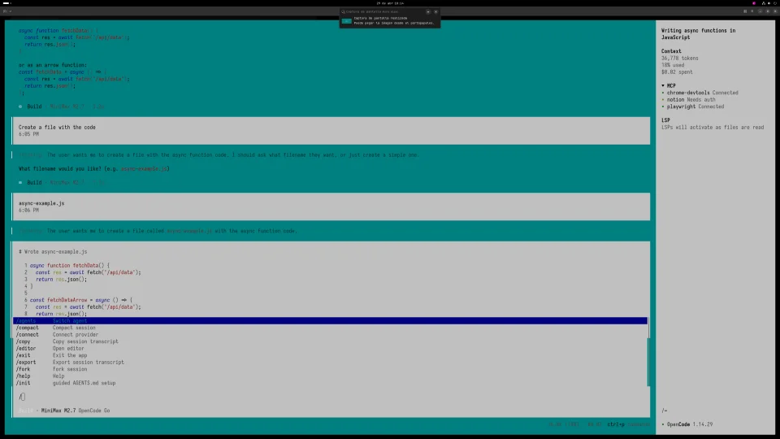

#### [`norton-commander`](themes/norton-commander.json)

Blue terminal panels inspired by the classic file-manager interface.

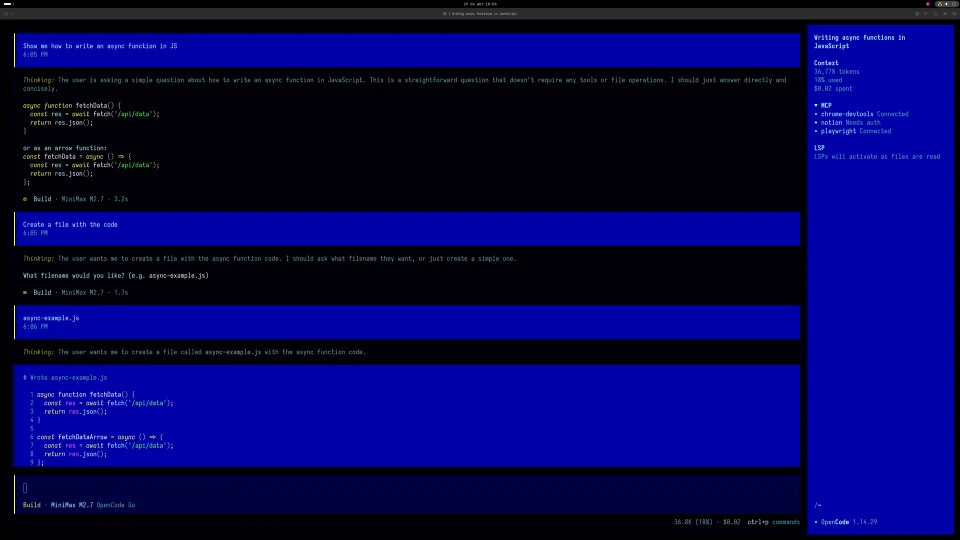

#### [`ibm-old-terminal`](themes/ibm-old-terminal.json)

Black screen, green phosphor, and minimal IBM terminal atmosphere.

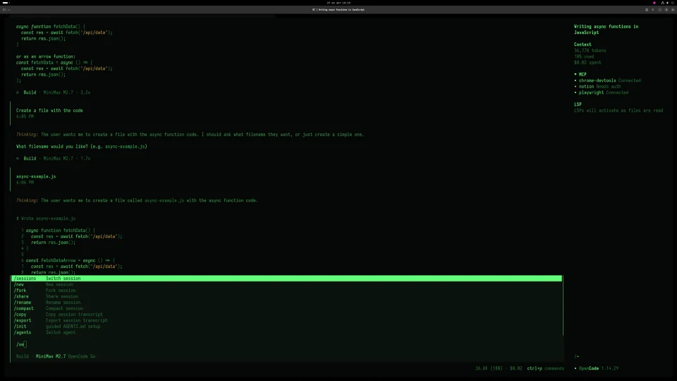

#### [`cga`](themes/cga.json)

Early PC color logic with bold cyan, dark contrast, and CGA-era sharpness.

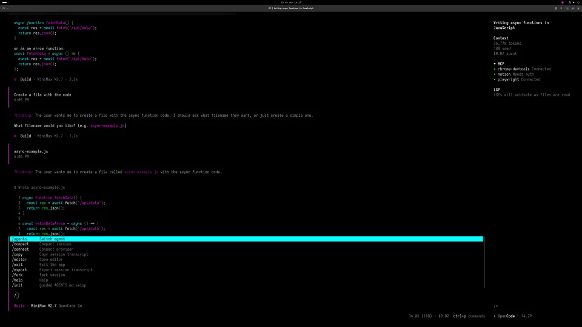

---

### Consoles & Video Games

#### [`theme-station-2`](themes/theme-station-2.json)

Dark PS2-inspired palette with deep blacks and electric blue highlights.

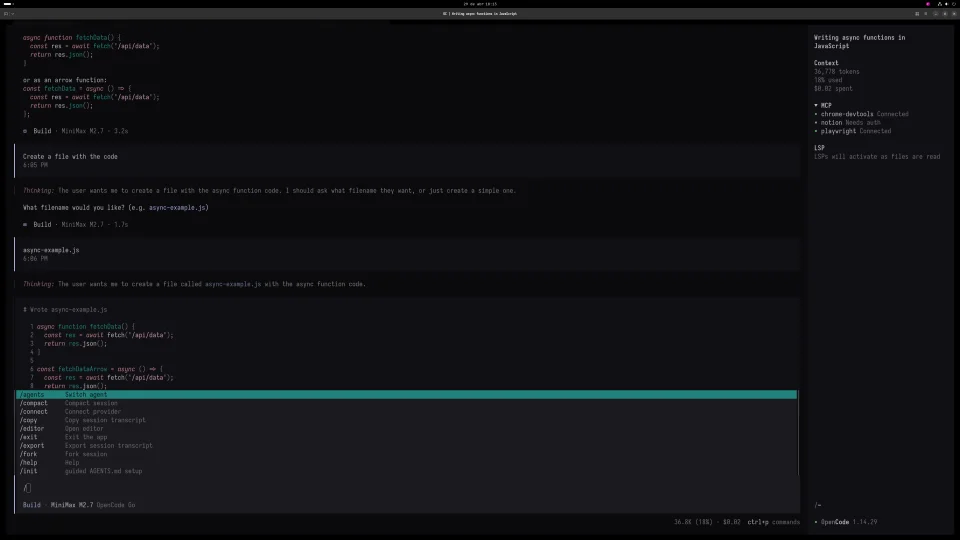

#### [`theme-station-1`](themes/theme-station-1.json)

Soft PlayStation gray with muted contrast and a classic console surface.

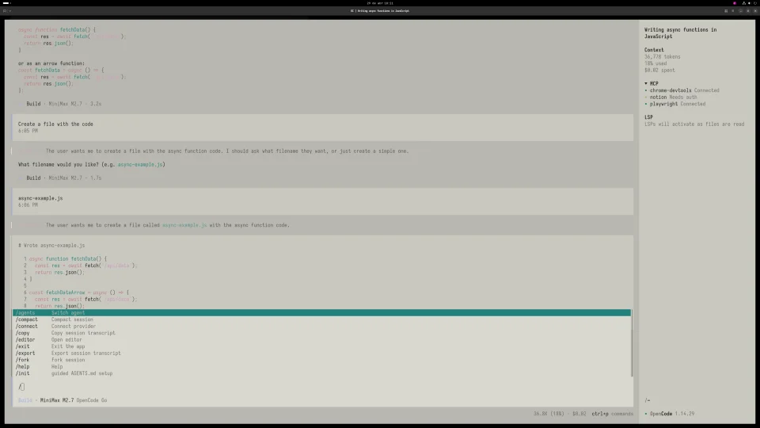

#### [`theme-cube`](themes/theme-cube.json)

GameCube purple and console-era saturation with a playful hardware feel.

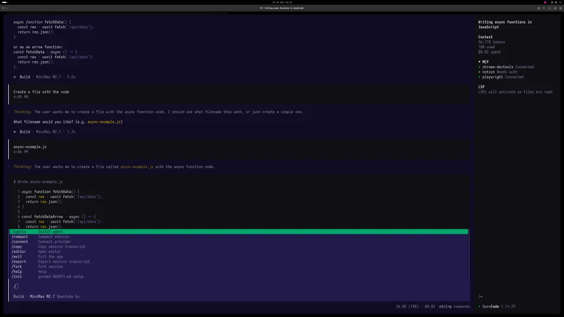

#### [`family-computheme`](themes/family-computheme.json)

Famicom cream and red, tuned for a warm vintage console look.

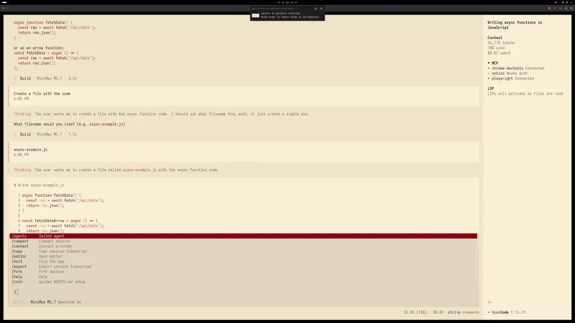

#### [`super-theme`](themes/super-theme.json)

Classic SNES gray with restrained purple accents and readable contrast.

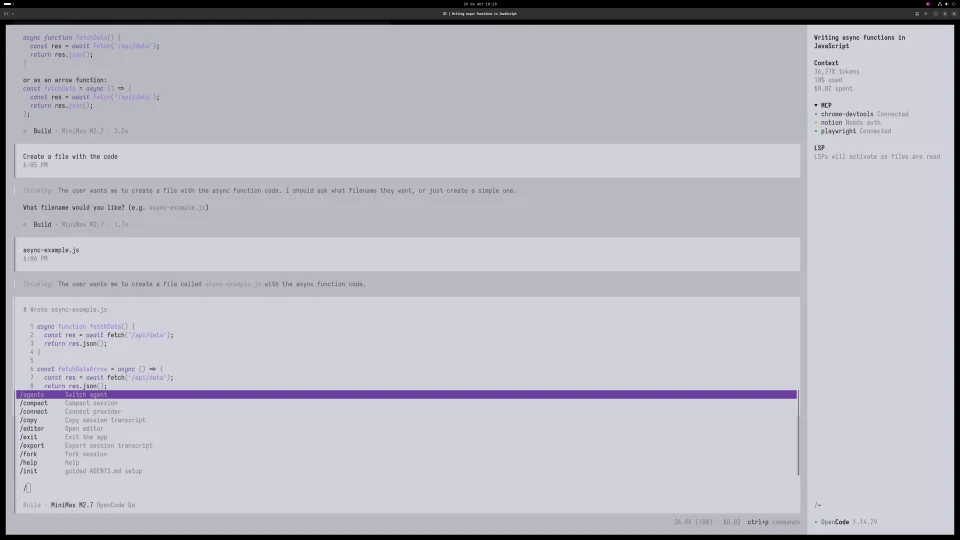

#### [`super-color`](themes/super-color.json)

SNES multicolor controls translated into a brighter terminal palette.

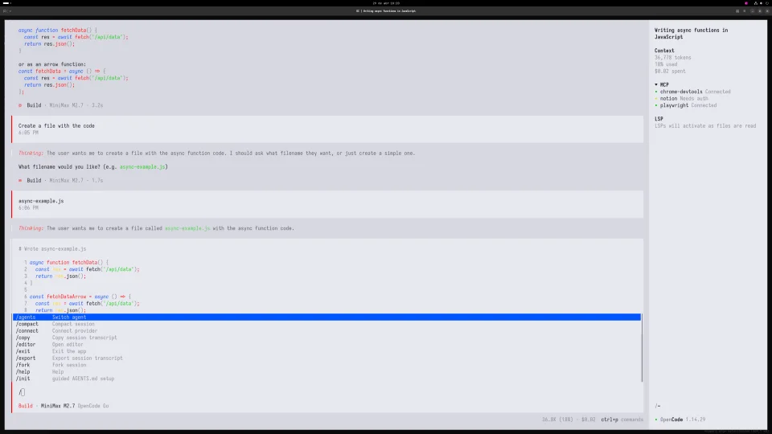

---

### Special Themes

#### [`silicon-trace`](themes/silicon-trace.json)

Circuit-board greens and hardware-lab contrast for a PCB-inspired terminal.

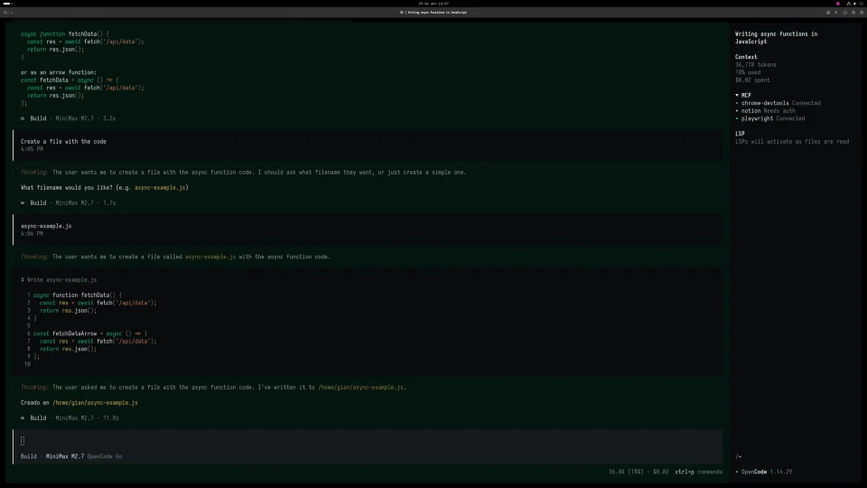

#### [`faded-neon`](themes/faded-neon.json)

Dim neon glow with worn pink and green accents for late-night sessions.

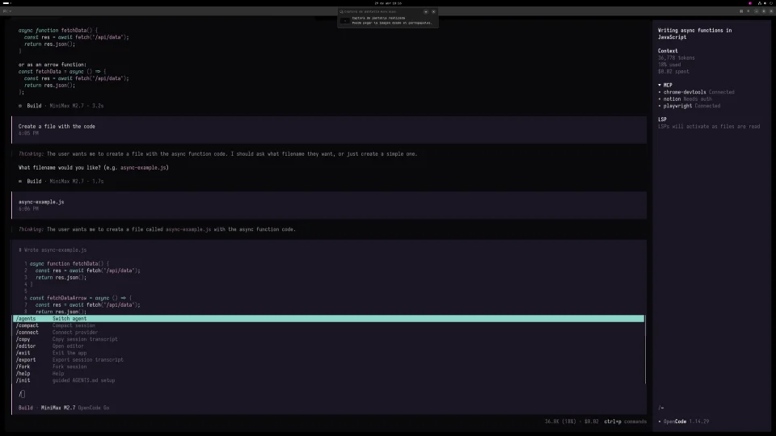

---

## Repository Structure

```text
Inume-Opencode-Retro-Themes/
├── assets/
│   └── screenshots/         # README previews
├── scripts/                 # Validation utilities
├── themes/                  # OpenCode theme JSON files
├── LICENSE
└── README.md
```

## License

[MIT](LICENSE)
